# Lab 04 CER Certificates (Part 01)  
##### Apuntes para TIK sobre certificados (Dic 2017)

### TOOLS

>[ASN.1 JavaScript decoder](https://lapo.it/asn1js/)

>[Openssl](https://www.openssl.org/)

>[DumpASN1 - ASN.1 object dump/syntax check program](http://manpages.ubuntu.com/manpages/xenial/man1/dumpasn1.1.html) del autor [Peter Gutmann](https://www.cs.auckland.ac.nz/~pgut001/)

>[XCA - X Certificate and key management](http://xca.sourceforge.net/) (c) by Christian Hohnstädt, christian@hohnstaedt.de]

>[CSR Decoder and Certificate Decoder (Red Krestel)(new)](https://redkestrel.co.uk/products/decoder/)

>[CSR Decoder And Certificate Decoder(Red Krestel)(old)](https://certlogik.com/decoder/)

>[MMC - Microsoft Management Console](https://msdn.microsoft.com/en-us/library/bb742441.aspx)

>[KeyStore Explorer](http://keystore-explorer.org/downloads.html) KeyStore Explorer is an open source GUI replacement for the Java command-line utilities keytool and jarsigner. KeyStore Explorer presents their functionality, and more, via an intuitive graphical user interface.

### Preparación del laboratorio

Creacion del directorio de trabajo del lab:

```
$ mkdir -pv $HOME/labs/lab04_CER_01
mkdir: se ha creado el directorio '/home/devel1/labs/lab04_CER_01'
$ cd $HOME/labs/lab04_CER_01
$ pwd
/home/devel1/labs/lab04_CER_01
```
## INTRODUCCION (breve) a Certificados

### Certificados

>[Public key certificate - Wikipedia (en)](https://en.wikipedia.org/wiki/Public_key_certificate)

>In cryptography, a **public key certificate**, also known as a **digital certificate** or **identity certificate**, is an electronic document used to prove the ownership of a public key.
> 
>The **certificate includes information** about:
>* the key, 
>* information about the identity of its owner (called the subject), 
>* and the digital signature of an entity that has verified the certificate's contents (called the issuer). 
>
>If the signature is valid, and the software examining the certificate trusts the issuer, then it can use that key to communicate securely with the certificate's subject.
>* In **email encryption**, **code signing**, and **e-signature systems**, a certificate's subject is typically a **person** or **organization**. 
>* However, in **Transport Layer Security (TLS)** a certificate's subject is typically a **computer** or **other device**, though TLS certificates may identify organizations or individuals in addition to their core role in identifying devices. **TLS**, sometimes called by its older name **Secure Sockets Layer (SSL)**, is notable for being a part of **HTTPS**, a protocol for securely browsing the web.
>
>In a typical **public-key infrastructure (PKI) scheme**, the **certificate issuer** is a **certificate authority (CA)**, usually a company that charges customers to issue certificates for them. 
>
>By contrast, in a web of trust scheme, individuals sign each other's keys directly, in a format that performs a similar function to a public key certificate.
>
>The **most common format for public key certificates** is defined by **X.509**. Because X.509 is very general, the format is **further constrained by profiles** defined for certain use cases, such as **Public Key Infrastructure (X.509) as defined in RFC 5280**.

>**Tipos de certificados**: [ver Infraestructura de clave pública - Wikipedia (es)](https://es.wikipedia.org/wiki/Infraestructura_de_clave_p%C3%BAblica)
>
>Existen diferentes **tipos** de **certificado digital**, en función de la información que contiene cada uno y a nombre de quién se emite el certificado:
>
>* **Certificado personal**, que acredita la identidad del titular.
>* **Certificado de pertenencia a empresa**, que además de la identidad del titular acredita su vinculación con la entidad para la que trabaja.
>* **Certificado de representante**, que además de la pertenencia a empresa acredita también los poderes de representación que el titular tiene sobre la misma.
>* **Certificado de persona jurídica**, que identifica una empresa o sociedad como tal a la hora de realizar trámites ante las administraciones o instituciones.
>* **Certificado de atributo** , el cual permite identificar una cualidad, estado o situación. Este tipo de certificado va asociado al certificado personal. (p.ej. Médico, Director, Casado, Apoderado de..., etc.).
>
>Además, existen otros tipos de certificado digital utilizados en entornos más técnicos:
>* **Certificado de servidor seguro**, utilizado en los servidores web que quieren proteger ante terceros el intercambio de información con los usuarios.
Certificado de firma de código, para garantizar la autoría y la no modificación del código de aplicaciones informáticas.

>[X.509 - Structure_of_a_certificate - Wikipedia (en)](https://en.wikipedia.org/wiki/X.509#Structure_of_a_certificate)

>**Common fields** (tomado de [X.509 - Structure_of_a_certificate - Wikipedia (en)](https://en.wikipedia.org/wiki/X.509#Structure_of_a_certificate) ) 
>
>These are some of the most common fields in certificates. Most certificates contain a number of fields not listed here. Note that in terms of a certificate's X.509 representation, a certificate is not "flat" but contains these fields nested in various structures within the certificate:
>* **Serial Number**: Used to uniquely identify the certificate within a CA's systems. In particular this is used to track revocation information.
>* **Subject**: The entity a certificate belongs to: a machine, an individual, or an organization.
>* **Issuer**: The entity that verified the information and signed the certificate.
>* **Not Before**: The earliest time and date on which the certificate is valid. Usually set to a few hours or days prior to the moment the certificate was issued, to avoid clock skew problems.
>* **Not After**: The time and date past which the certificate is no longer valid.
>* **Key Usage**: The valid cryptographic uses of the certificate's public key. Common values include **digital signature validation**, **key encipherment**, and **certificate signing**.
**Extended Key Usage**: The applications in which the certificate may be used. Common values include **TLS server authentication**, **email protection**, and **code signing**.
>* **Public Key**: A public key belonging to the certificate subject.
>* **Signature Algorithm**: The algorithm used to sign the public key certificate.
>* **Signature**: A signature of the certificate body by the issuer's private key.

>**Certificate filename extensions** (tomado de [X.509 - Structure_of_a_certificate - Wikipedia (en)](https://en.wikipedia.org/wiki/X.509#Structure_of_a_certificate) ):
>
>There are several commonly used filename extensions for X.509 certificates. Unfortunately, some of these extensions are also used for other data such as private keys.
>* **.pem** – `(Privacy-enhanced Electronic Mail)` Base64 encoded DER certificate, enclosed between "-----BEGIN CERTIFICATE-----" and "-----END CERTIFICATE-----"
>* **.cer, .crt, .der** – usually in binary `DER` form, but Base64-encoded certificates are common too (see .pem above)
>* **.p7b, .p7c** – `PKCS#7 SignedData structure` without data, just certificate(s) or CRL(s)
>* **.p12** – `PKCS#12`, may contain certificate(s) (public) and private keys (password protected)
>* **.pfx – PFX**, predecessor of PKCS#12 (usually contains data in PKCS#12 format, e.g., with PFX files generated in IIS)
>
>**PKCS#7** is a standard for signing or encrypting (officially called "enveloping") data. Since the certificate is needed to verify signed data, it is possible to include them in the SignedData structure. A `.P7C` file is a degenerated SignedData structure, without any data to sign.
>
>**PKCS#12** evolved from the personal information exchange `(PFX)` standard and is used to exchange public and private objects in a single file

### PKI - Public key infrastructure y Certificate Enrollment Process

>[PKI - Infraestructura de clave pública - Wikipedia (es)](https://es.wikipedia.org/wiki/Infraestructura_de_clave_p%C3%BAblica)

>**Componentes de una Infraestructura de clave pública** (tomado de: [PKI - Infraestructura de clave pública - Wikipedia (es)](https://es.wikipedia.org/wiki/Infraestructura_de_clave_p%C3%BAblica) ):
>
>Los componentes más habituales de una infraestructura de clave pública son:
>* La **autoridad de certificación** (o, en inglés, **CA**, **Certificate Authority**): es la encargada de emitir y revocar certificados. Es la entidad de confianza que da legitimidad a la relación de una clave pública con la identidad de un usuario o servicio.
>* La **autoridad de registro** (o, en inglés, **RA**, **Registration Authority**): es la responsable de verificar el enlace entre los certificados (concretamente, entre la clave pública del certificado) y la identidad de sus titulares.
>* Los **repositorios**: son las estructuras encargadas de almacenar la información relativa a la PKI. Los dos repositorios más importantes son:
>   * el **repositorio de certificados** y 
>   * el **repositorio de listas de revocación de certificados**. En una lista de revocación de certificados (o, en inglés, **CRL**, **Certificate Revocation List**) se incluyen todos aquellos certificados que por algún motivo han dejado de ser válidos antes de la fecha establecida dentro del mismo certificado.
>* La **autoridad de validación** (o, en inglés, **VA**, **Validation Authority)**: es la encargada de comprobar la validez de los certificados digitales.
>* La **autoridad de sellado de tiempo** (o, en inglés, **TSA**, **TimeStamp Authority**): es la encargada de firmar documentos con la finalidad de probar que existían antes de un determinado instante de tiempo.
>* Los **usuarios** y **entidades finales** son aquellos que poseen un **par de claves (pública y privada)** y un **certificado** asociado a su **clave pública**. Utilizan un conjunto de aplicaciones que hacen uso de la tecnología **PKI** (para **validar firmas digitales**, **cifrar documentos** para otros usuarios, etc.)

>[Public key infrastructure - Wikipedia (en)](https://en.wikipedia.org/wiki/Public_key_infrastructure)

>[What is PKI (public key infrastructure)? - Definition from WhatIs.com](http://searchsecurity.techtarget.com/definition/PKI)

>[NetContractor Blog » Certificate Enrollment Process](http://www.netcontractor.pl/blog/wp-content/uploads/2014/11/Certificate-Enrollment-Process.ppsx)

>[IETF - RFC5280 Internet X.509 Public Key Infrastructure Certificate - and Certificate Revocation List (CRL) Profile](https://tools.ietf.org/html/rfc5280)

>[Understanding Certification Path Construction (PDF)](http://www.oasis-pki.org/pdfs/Understanding_Path_construction-DS2.pdf)

## PKCS

>[Wikipedia (ES) PKCS](https://es.wikipedia.org/wiki/PKCS)

>[Wikipedia (EN) PKCS](https://en.wikipedia.org/wiki/PKCS)

>[Public-Key Cryptography Standards `(PKCS)` (RSA Laboratories - _ARCHIVO_)](https://web.archive.org/web/20061209135809/http://www.rsasecurity.com/rsalabs/node.asp?id=2124)

>[PKCS #7: PKCS #7: Cryptographic Message Syntax Standard (RSA Laboratories - _ARCHIVO_)](https://web.archive.org/web/20061210143318/http://www.rsasecurity.com/rsalabs/node.asp?id=2129)

>[PKCS #12: PKCS #12: Personal Information Exchange Syntax Standard (RSA Laboratories - _ARCHIVO_)](https://web.archive.org/web/20061210143421/http://www.rsasecurity.com/rsalabs/node.asp?id=2138)


# Seccion 01 - Ejemplo de `Certificate Enrollment Process` de un Certificado de `Servidor` (`Dominio`)


## 01.01 Del lado del `SOLICITANTE`

### Paso 1. Creación del `Key pair RSA` (con clave protegida `DES3 + PBE`) y a continuación realizar la creación de un `CSR - Certificate Signing Request` para identificar un dominio de servidor con `Subject Alternative Names`

>NOTA: Ver [Lab03_CSR](https://github.com/psanchosopranis/TIK_CERTIFICADOS_2017/blob/master/Lab03_CSR.md) para un mayor detalle de los pasos que se describen a continuación. 

### Alternativa 1: Con `openssl`

#### Generación del `Key pair RSA` (con clave protegida `DES3 + PBE`)
```
openssl genrsa -out labtik122017_privkey.pem -des3 -passout pass:changeit 2048
``` 

Bitácora:
```
$ openssl genrsa -out labtik122017_privkey.pem -des3 -passout pass:changeit 2048
Generating RSA private key, 2048 bit long modulus
..+++
......................................................................+++
e is 65537 (0x10001)
```

####  Generación del `CSR - Certificate Signing Request`

```
printf '[SAN]\nsubjectAltName=DNS:labtik122017,DNS:labtik122017.techedgegroup.es,IP:127.0.0.1\n' > config_san_labtik122017.cnf && cat config_san_labtik122017.cnf

cat /etc/ssl/openssl.cnf config_san_labtik122017.cnf > openssl_config_san_labtik122017.cnf && rm config_san_labtik122017.cnf

openssl req -new -utf8 -sha256 \
-key labtik122017_privkey.pem -passin pass:changeit \
-subj "/C=ES/ST=Madrid/L=Madrid/O=TIK Techedge Institute of Knowledge/OU=Admin Lab Demo Servers/CN=labtik122017.techedgegroup.es" \
-reqexts SAN -extensions SAN -config openssl_config_san_labtik122017.cnf \
-out CSR_labtik122017_SAN.pem
```

En una sóla línea:
```
openssl req -new -utf8 -sha256 -key labtik122017_privkey.pem -passin pass:changeit -subj "/C=ES/ST=Madrid/L=Madrid/O=TIK Techedge Institute of Knowledge/OU=Admin Lab Demo Servers/CN=labtik122017.techedgegroup.es" -reqexts SAN -extensions SAN -config openssl_config_san_labtik122017.cnf -out CSR_labtik122017_SAN.pem
```

Comprobación:
```
openssl req -text -in CSR_labtik122017_SAN.pem -inform PEM
```

Bitácora:
```
$ printf '[SAN]\nsubjectAltName=DNS:labtik122017,DNS:labtik122017.techedgegroup.es,IP:127.0.0.1\n' > config_san_labtik122017.cnf && cat config_san_labtik122017.cnf
[SAN]
subjectAltName=DNS:labtik122017,DNS:labtik122017.techedgegroup.es,IP:127.0.0.1

$ cat /etc/ssl/openssl.cnf config_san_labtik122017.cnf > openssl_config_san_labtik122017.cnf && rm config_san_labtik122017.cnf

$ tail -5 openssl_config_san_labtik122017.cnf
				# (optional, default: no)
ess_cert_id_chain	= no	# Must the ESS cert id chain be included?
				# (optional, default: no)
[SAN]
subjectAltName=DNS:labtik122017,DNS:labtik122017.techedgegroup.es,IP:127.0.0.1

$ openssl req -new -utf8 -sha256 \
> -key labtik122017_privkey.pem -passin pass:changeit \
> -subj "/C=ES/ST=Madrid/L=Madrid/O=TIK Techedge Institute of Knowledge/OU=Admin Lab Demo Servers/CN=labtik122017.techedgegroup.es" \
> -reqexts SAN -extensions SAN -config openssl_config_san_labtik122017.cnf \
> -out CSR_labtik122017_SAN.pem

$ openssl req -text -in CSR_labtik122017_SAN.pem -inform PEM
Certificate Request:
    Data:
        Version: 0 (0x0)
        Subject: C=ES, ST=Madrid, L=Madrid, O=TIK Techedge Institute of Knowledge, OU=Admin Lab Demo Servers, CN=labtik122017.techedgegroup.es
        Subject Public Key Info:
            Public Key Algorithm: rsaEncryption
                Public-Key: (2048 bit)
                Modulus:
                    00:b9:9d:9c:b8:5d:6e:16:b8:e9:28:dc:87:87:0f:
                    fd:88:03:3a:5c:0d:1c:9f:ba:a3:58:16:f6:3c:31:
                    49:2f:50:f5:98:8c:80:23:35:4e:89:be:7a:b6:7f:
                    c8:cd:45:ff:ba:71:ac:95:cb:dc:a9:2d:8a:16:44:
                    1b:82:12:f1:75:f4:d2:1c:5f:52:a0:ac:9b:87:fb:
                    59:0d:c9:1c:e0:89:ba:5e:a3:61:54:0a:d0:60:b3:
                    30:29:a2:11:39:b9:3e:1d:e3:9f:0f:7f:8c:78:1f:
                    51:fa:92:0a:63:66:0e:2b:cf:7f:d9:18:e8:45:be:
                    41:2b:36:27:97:1c:61:a8:f2:5d:ba:0a:f3:5b:c7:
                    45:ad:45:c4:cd:5e:8a:bd:df:1e:03:b1:0e:a5:09:
                    bf:41:35:3a:54:c8:d5:c1:fb:c0:45:dd:a5:d4:cf:
                    54:0c:12:40:db:ba:2a:52:12:66:55:0c:c0:80:93:
                    e5:c2:db:95:2c:c3:0e:d9:4b:9d:c5:f0:22:48:b5:
                    96:e0:59:d9:93:b4:46:cd:a5:27:70:1a:37:ab:ff:
                    1f:33:7e:72:92:db:e4:e1:33:2a:33:37:87:dc:f3:
                    47:92:b5:18:bd:e6:ea:09:a2:3a:08:9f:bd:02:26:
                    89:20:c7:19:1a:09:a5:7f:6f:e0:6c:84:4f:99:62:
                    65:5b
                Exponent: 65537 (0x10001)
        Attributes:
        Requested Extensions:
            X509v3 Subject Alternative Name: 
                DNS:labtik122017, DNS:labtik122017.techedgegroup.es, IP Address:127.0.0.1
    Signature Algorithm: sha256WithRSAEncryption
         6b:45:32:a7:7c:00:cf:f4:c5:55:9b:1d:3a:dc:87:26:b4:df:
         a7:13:96:35:19:82:72:25:39:dc:90:81:8d:b9:70:e9:09:4a:
         af:65:56:34:85:8f:85:7c:39:04:77:ab:1e:b5:75:e9:ff:60:
         4e:41:f1:cd:fa:e9:e5:50:75:05:0d:6a:60:9c:ef:09:3e:5d:
         dd:4a:b4:76:07:67:9d:77:66:4b:7f:0c:e3:82:c0:36:22:71:
         38:17:31:4d:d5:c3:08:da:d6:03:4f:1a:3a:80:ff:32:3d:61:
         93:89:b9:5c:11:fc:59:8b:b4:b2:d2:57:88:e6:16:3d:16:b1:
         d4:0f:e4:9a:77:c1:e1:df:bb:a1:14:6e:69:6d:10:ed:90:95:
         89:21:f6:50:79:f4:b3:fd:df:f3:53:7d:81:8b:15:b0:34:85:
         28:e6:86:3e:3b:51:33:a0:24:fe:e4:63:da:ef:b9:74:68:8a:
         ef:c1:e0:71:ed:e4:b9:90:d5:a5:a2:c1:f7:b7:5a:38:26:f1:
         5c:c1:32:b5:5e:f4:6d:43:64:ba:b4:97:71:2b:d9:1b:53:c1:
         40:98:f6:69:01:a7:03:16:29:58:be:07:a8:c7:3c:5e:00:c6:
         41:40:c8:15:14:e4:42:b6:04:2e:e3:8c:cc:f8:c6:a7:27:8a:
         81:3e:be:e6
-----BEGIN CERTIFICATE REQUEST-----
MIIDOzCCAiMCAQAwgaYxCzAJBgNVBAYTAkVTMQ8wDQYDVQQIDAZNYWRyaWQxDzAN
BgNVBAcMBk1hZHJpZDEsMCoGA1UECgwjVElLIFRlY2hlZGdlIEluc3RpdHV0ZSBv
ZiBLbm93bGVkZ2UxHzAdBgNVBAsMFkFkbWluIExhYiBEZW1vIFNlcnZlcnMxJjAk
BgNVBAMMHWxhYnRpazEyMjAxNy50ZWNoZWRnZWdyb3VwLmVzMIIBIjANBgkqhkiG
9w0BAQEFAAOCAQ8AMIIBCgKCAQEAuZ2cuF1uFrjpKNyHhw/9iAM6XA0cn7qjWBb2
PDFJL1D1mIyAIzVOib56tn/IzUX/unGslcvcqS2KFkQbghLxdfTSHF9SoKybh/tZ
Dckc4Im6XqNhVArQYLMwKaIRObk+HeOfD3+MeB9R+pIKY2YOK89/2RjoRb5BKzYn
lxxhqPJdugrzW8dFrUXEzV6Kvd8eA7EOpQm/QTU6VMjVwfvARd2l1M9UDBJA27oq
UhJmVQzAgJPlwtuVLMMO2UudxfAiSLWW4FnZk7RGzaUncBo3q/8fM35yktvk4TMq
MzeH3PNHkrUYvebqCaI6CJ+9AiaJIMcZGgmlf2/gbIRPmWJlWwIDAQABoE8wTQYJ
KoZIhvcNAQkOMUAwPjA8BgNVHREENTAzggxsYWJ0aWsxMjIwMTeCHWxhYnRpazEy
MjAxNy50ZWNoZWRnZWdyb3VwLmVzhwR/AAABMA0GCSqGSIb3DQEBCwUAA4IBAQBr
RTKnfADP9MVVmx063IcmtN+nE5Y1GYJyJTnckIGNuXDpCUqvZVY0hY+FfDkEd6se
tXXp/2BOQfHN+unlUHUFDWpgnO8JPl3dSrR2B2edd2ZLfwzjgsA2InE4FzFN1cMI
2tYDTxo6gP8yPWGTiblcEfxZi7Sy0leI5hY9FrHUD+Sad8Hh37uhFG5pbRDtkJWJ
IfZQefSz/d/zU32BixWwNIUo5oY+O1EzoCT+5GPa77l0aIrvweBx7eS5kNWlosH3
t1o4JvFcwTK1XvRtQ2S6tJdxK9kbU8FAmPZpAacDFilYvgeoxzxeAMZBQMgVFORC
tgQu44zM+ManJ4qBPr7m
-----END CERTIFICATE REQUEST-----
``` 

### Alternativa 2: Con `Java keytool`

#### Generación de un `JKS` con el `Key pair RSA` (con clave protegida)

```
keytool -genkey -alias labtik122017_keypair \
-keyalg RSA -keysize 2048 -storetype JKS \
-validity 99999 -keypass changeit \
-storepass changeit -keystore labtik122017_privkey.jks \
-dname "CN=labtik122017.techedgegroup.es, OU=Admin Lab Demo Servers, O=TIK Techedge Institute of Knowledge, L=Madrid, S=Madrid, C=ES"
```

En una sóla línea:
```
keytool -genkey -alias labtik122017_keypair -keyalg RSA -keysize 2048 -storetype JKS -validity 99999 -keypass changeit -storepass changeit -keystore labtik122017_privkey.jks -dname "CN=labtik122017.techedgegroup.es, OU=Admin Lab Demo Servers, O=TIK Techedge Institute of Knowledge, L=Madrid, S=Madrid, C=ES"
```

Bitácora:
```
$ keytool -genkey -alias labtik122017_keypair \
> -keyalg RSA -keysize 2048 -storetype JKS \
> -validity 99999 -keypass changeit \
> -storepass changeit -keystore labtik122017_privkey.jks \
> -dname "CN=labtik122017.techedgegroup.es, OU=Admin Lab Demo Servers, O=TIK Techedge Institute of Knowledge, L=Madrid, S=Madrid, C=ES"

Warning:
El almacén de claves JKS utiliza un formato propietario. Se recomienda migrar a PKCS12, que es un formato estándar del sector que utiliza "keytool -importkeystore -srckeystore labtik122017_privkey.jks -destkeystore labtik122017_privkey.jks -deststoretype pkcs12".
```

Visualizado con Keytool Explorer:

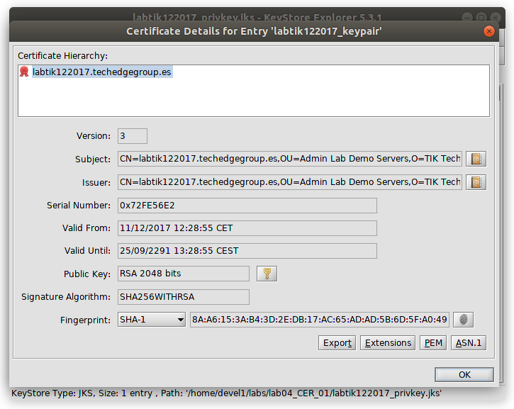

####  Generación del `CSR - Certificate Signing Request`

```
keytool -certreq -keyalg SHA2withRSA -alias labtik122017_keypair \
-validity 1095 \
-storetype JKS -keypass changeit -storepass changeit -keystore labtik122017_privkey.jks \
-dname "CN=labtik122017.techedgegroup.es, OU=Admin Lab Demo Servers, O=TIK Techedge Institute of Knowledge, L=Madrid, S=Madrid, C=ES" \
-ext SAN=DNS:labtik122017.techedgegroup.es,DNS:labtik122017,IP:127.0.0.1 \
-file CSR_labtik122017_SAN_keytool.pem
```

En una sola línea:
```
keytool -certreq -keyalg SHA2withRSA -alias labtik122017_keypair -validity 1095 -storetype JKS -keypass changeit -storepass changeit -keystore labtik122017_privkey.jks -dname "CN=labtik122017.techedgegroup.es, OU=Admin Lab Demo Servers, O=TIK Techedge Institute of Knowledge, L=Madrid, S=Madrid, C=ES" -ext SAN=DNS:labtik122017.techedgegroup.es,DNS:labtik122017,IP:127.0.0.1 -file CSR_labtik122017_SAN_keytool.pem
```

Comprobación:
```
openssl req -text -in CSR_labtik122017_SAN_keytool.pem -inform PEM
```

Visualizado con Keytool Explorer:

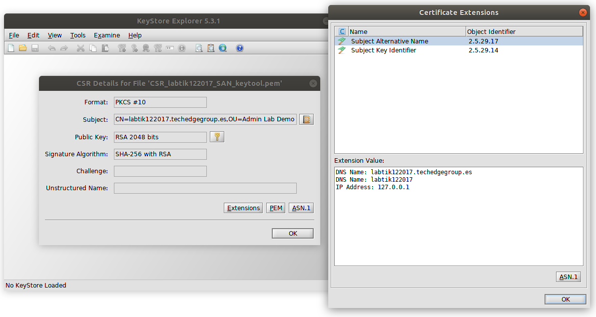

Bitácora:
```
$ keytool -certreq -keyalg SHA2withRSA -alias labtik122017_keypair \
> -validity 1095 \
> -storetype JKS -keypass changeit -storepass changeit -keystore labtik122017_privkey.jks \
> -dname "CN=labtik122017.techedgegroup.es, OU=Admin Lab Demo Servers, O=TIK Techedge Institute of Knowledge, L=Madrid, S=Madrid, C=ES" \
> -ext SAN=DNS:labtik122017.techedgegroup.es,DNS:labtik122017,IP:127.0.0.1 \
> -file CSR_labtik122017_SAN_keytool.pem

Warning:
El almacén de claves JKS utiliza un formato propietario. Se recomienda migrar a PKCS12, que es un formato estándar del sector que utiliza "keytool -importkeystore -srckeystore labtik122017_privkey.jks -destkeystore labtik122017_privkey.jks -deststoretype pkcs12".

$ openssl req -text -in CSR_labtik122017_SAN_keytool.pem -inform PEM
Certificate Request:
    Data:
        Version: 0 (0x0)
        Subject: C=ES, ST=Madrid, L=Madrid, O=TIK Techedge Institute of Knowledge, OU=Admin Lab Demo Servers, CN=labtik122017.techedgegroup.es
        Subject Public Key Info:
            Public Key Algorithm: rsaEncryption
                Public-Key: (2048 bit)
                Modulus:
                    00:87:bb:49:75:34:eb:f7:b5:d9:b6:66:0b:5a:5e:
                    37:96:53:1e:0e:f5:62:cd:b2:22:08:26:43:32:ea:
                    c2:b0:66:8a:ff:88:ef:55:53:4f:71:37:1e:1d:1c:
                    a3:43:82:ef:5a:c7:45:a1:4e:ec:5f:85:50:7b:1a:
                    36:a8:75:39:af:0a:ef:cc:6c:f4:bf:b7:c3:0e:b0:
                    4e:83:9b:49:82:81:f9:dc:5a:d0:ba:dd:87:3a:19:
                    2c:57:fb:b9:94:d1:4a:9a:ab:25:e9:73:e7:5a:db:
                    eb:6f:da:c4:fe:72:50:48:5c:e5:8a:29:0e:4c:73:
                    3c:2b:18:99:23:08:56:6b:dd:3f:a0:18:ec:96:eb:
                    cf:03:51:a4:37:60:36:33:97:4c:57:ea:30:44:7f:
                    a4:91:2e:db:95:c1:b8:b0:ca:51:50:f2:97:c6:d0:
                    b8:45:0a:2c:74:01:06:6b:bf:f6:b8:1b:3e:a4:4b:
                    74:fe:3f:4d:fa:40:a8:5d:07:21:a9:44:26:fe:ce:
                    f4:9b:3c:e3:ec:8a:b2:d7:47:ea:0f:96:38:fb:ab:
                    4f:41:73:42:15:6e:0d:44:c8:20:a0:5f:6e:f9:89:
                    4d:4c:11:42:24:f3:5f:5c:72:64:2a:88:c5:fc:91:
                    7a:53:e5:76:15:7b:82:fa:db:7b:29:bb:ce:81:05:
                    e3:09
                Exponent: 65537 (0x10001)
        Attributes:
        Requested Extensions:
            X509v3 Subject Alternative Name: 
                DNS:labtik122017.techedgegroup.es, DNS:labtik122017, IP Address:127.0.0.1
            X509v3 Subject Key Identifier: 
                92:22:B3:F5:02:D9:8F:B5:78:FA:E1:6B:76:27:C7:5D:88:08:0B:09
    Signature Algorithm: sha256WithRSAEncryption
         61:55:6e:63:32:ce:7b:2e:7e:37:8b:c3:81:95:75:c8:bb:ce:
         7a:5d:45:c0:70:fb:15:4c:64:98:da:4a:c6:0c:f4:43:dc:7b:
         14:58:77:62:af:7f:72:74:95:22:86:e2:5b:6f:94:65:ba:88:
         8d:04:13:a5:12:d7:c5:0e:e9:1a:21:3d:66:4e:9b:bf:9b:c6:
         a1:31:60:5d:81:e2:64:93:a6:46:28:72:ff:e2:bf:88:94:c6:
         7a:89:56:e0:4d:90:da:ed:d5:0d:17:c8:54:88:f1:37:36:d3:
         7c:ee:3b:7d:64:26:19:90:98:72:6f:22:a4:d9:71:7a:3b:3f:
         97:21:45:e5:46:02:0a:cd:fb:5d:0e:d5:13:09:e5:57:c7:b8:
         1e:00:59:03:08:ad:e7:8c:07:4a:30:99:41:d7:e3:cf:74:c8:
         54:9b:0b:dd:d5:a8:40:6c:72:0c:75:ac:29:4e:42:c9:24:1d:
         e7:94:40:6f:35:05:de:c6:c8:72:c6:a7:0d:16:e0:e5:f3:b4:
         93:cc:73:99:6a:1f:21:ae:a6:02:a8:c5:6a:53:e5:9b:85:d4:
         ec:1e:49:b6:17:77:db:5d:94:ef:f3:28:44:da:c6:77:8e:9d:
         67:00:69:a2:a6:1a:6e:5e:85:03:fa:2b:76:d9:44:49:93:62:
         06:69:d5:5c
-----BEGIN CERTIFICATE REQUEST-----
MIIDWjCCAkICAQAwgaYxCzAJBgNVBAYTAkVTMQ8wDQYDVQQIEwZNYWRyaWQxDzAN
BgNVBAcTBk1hZHJpZDEsMCoGA1UEChMjVElLIFRlY2hlZGdlIEluc3RpdHV0ZSBv
ZiBLbm93bGVkZ2UxHzAdBgNVBAsTFkFkbWluIExhYiBEZW1vIFNlcnZlcnMxJjAk
BgNVBAMTHWxhYnRpazEyMjAxNy50ZWNoZWRnZWdyb3VwLmVzMIIBIjANBgkqhkiG
9w0BAQEFAAOCAQ8AMIIBCgKCAQEAh7tJdTTr97XZtmYLWl43llMeDvVizbIiCCZD
MurCsGaK/4jvVVNPcTceHRyjQ4LvWsdFoU7sX4VQexo2qHU5rwrvzGz0v7fDDrBO
g5tJgoH53FrQut2HOhksV/u5lNFKmqsl6XPnWtvrb9rE/nJQSFzliikOTHM8KxiZ
IwhWa90/oBjsluvPA1GkN2A2M5dMV+owRH+kkS7blcG4sMpRUPKXxtC4RQosdAEG
a7/2uBs+pEt0/j9N+kCoXQchqUQm/s70mzzj7Iqy10fqD5Y4+6tPQXNCFW4NRMgg
oF9u+YlNTBFCJPNfXHJkKojF/JF6U+V2FXuC+tt7KbvOgQXjCQIDAQABoG4wbAYJ
KoZIhvcNAQkOMV8wXTA8BgNVHREENTAzgh1sYWJ0aWsxMjIwMTcudGVjaGVkZ2Vn
cm91cC5lc4IMbGFidGlrMTIyMDE3hwR/AAABMB0GA1UdDgQWBBSSIrP1AtmPtXj6
4Wt2J8ddiAgLCTANBgkqhkiG9w0BAQsFAAOCAQEAYVVuYzLOey5+N4vDgZV1yLvO
el1FwHD7FUxkmNpKxgz0Q9x7FFh3Yq9/cnSVIobiW2+UZbqIjQQTpRLXxQ7pGiE9
Zk6bv5vGoTFgXYHiZJOmRihy/+K/iJTGeolW4E2Q2u3VDRfIVIjxNzbTfO47fWQm
GZCYcm8ipNlxejs/lyFF5UYCCs37XQ7VEwnlV8e4HgBZAwit54wHSjCZQdfjz3TI
VJsL3dWoQGxyDHWsKU5CySQd55RAbzUF3sbIcsanDRbg5fO0k8xzmWofIa6mAqjF
alPlm4XU7B5Jthd3212U7/MoRNrGd46dZwBpoqYabl6FA/ordtlESZNiBmnVXA==
-----END CERTIFICATE REQUEST-----

```

## 01.02 Del lado de la `CA - Certification Authority`

Para simular este proceso utilizaremos la herramienta [XCA - X Certificate and key management](http://xca.sourceforge.net/) (c) by Christian Hohnstädt, christian@hohnstaedt.de]

Para ello, se ha creado una `Base de Datos` de certificados que soportará una _ficticia_ `CA Raiz` (CA Root) (Entidad Certificadora Raiz) que, a su vez, dispone de dos `CA Subsidiarias` (o `Entidades de Certificación Intermedias`), una para la emisión de **certificados personales** y la otra, para la emisión de **certificados de dominio/servidor**:

Dicha `Base de datos` puede [descargarse](https://github.com/psanchosopranis/TIK_CERTIFICADOS_2017/blob/master/LabCA/TIKDemoCA.xdb) desde este mismo repositorio. Está protegida por la contraseña `'changeit`'.

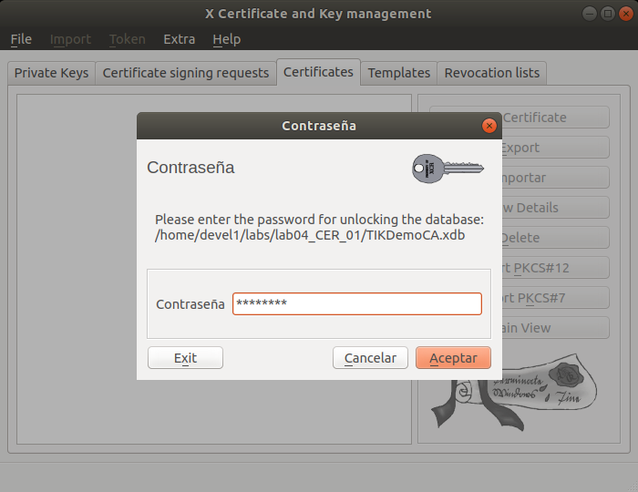

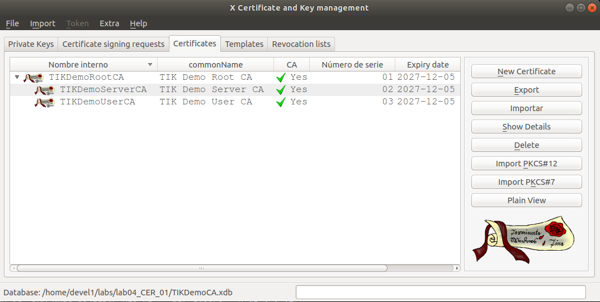


>**Certificate chains and cross-certification** (tomado de: [X.509 - Structure_of_a_certificate - Wikipedia (en)](https://en.wikipedia.org/wiki/X.509#Structure_of_a_certificate) )
>
>A **certificate chain** (see the equivalent concept of `"certification path"` defined by [RFC 5280](http://tools.ietf.org/html/rfc5280#page-71)) is a list of certificates (usually starting with an end-entity certificate) followed by one or more CA certificates (usually the last one being a self-signed certificate), with the following properties:
>
>* The Issuer of each certificate (except the last one) matches the Subject of the next certificate in the list.
>
>* Each certificate (except the last one) is supposed to be signed by the secret key corresponding to the next certificate in the chain (i.e. the signature of one certificate can be verified using the public key contained in the following certificate).
>
>* The last certificate in the list is a trust anchor: a certificate that you trust because it was delivered to you by some trustworthy procedure.
>
>Certificate chains are used in order to check that the public key (PK) contained in a target certificate (the first certificate in the chain) and other data contained in it effectively belongs to its subject. In order to ascertain this, the signature on the target certificate is verified by using the PK contained in the following certificate, whose signature is verified using the next certificate, and so on until the last certificate in the chain is reached. As the last certificate is a trust anchor, successfully reaching it will prove that the target certificate can be trusted.
>
>The description in the preceding paragraph is a simplified view on the certification path validation process as defined by [RFC 5280](http://tools.ietf.org/html/rfc5280#page-71), which involves additional checks, such as verifying validity dates on certificates, looking up CRLs, etc.


### Paso 1. Importación del CSR

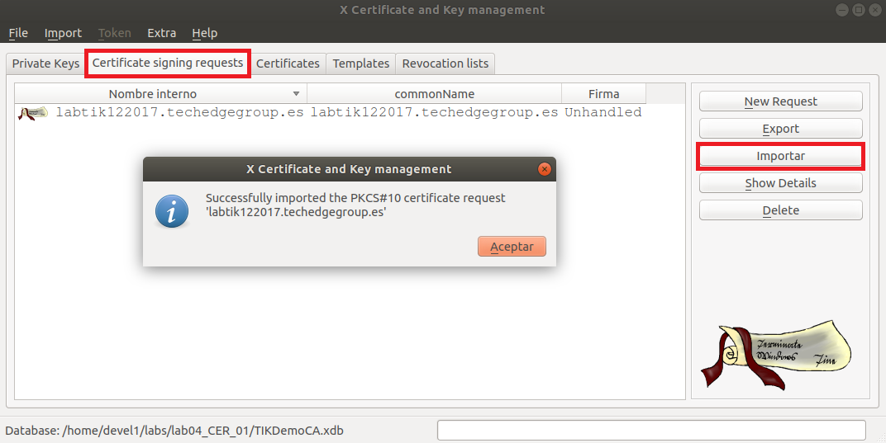

#### Visualizando sus propiedades:

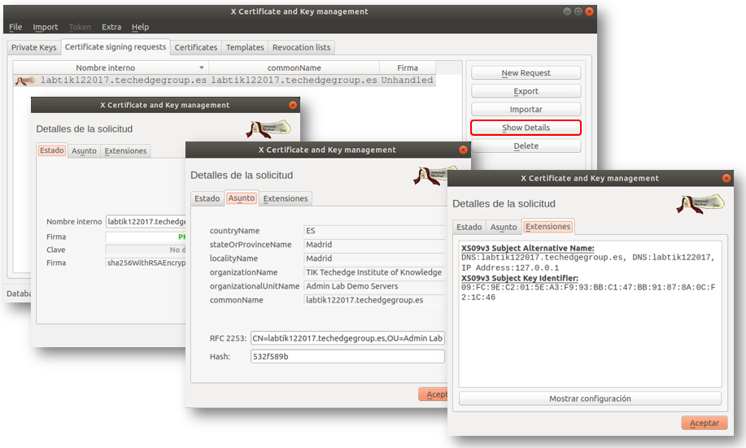

### Paso 2. Firma del `CSR` y generación del `Certificado X.509`:

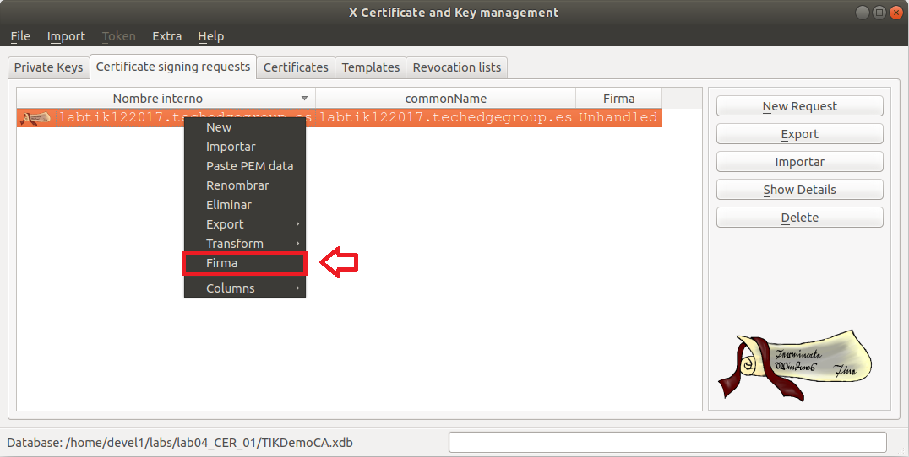

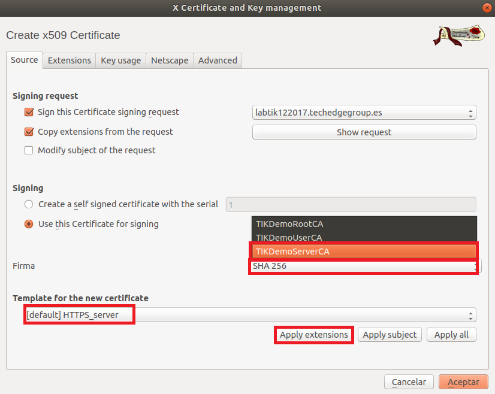

>**AVISO** No pulsar _todavía_ el botón `Aceptar`. Esto sólo se debe hacer al final cuando se haya navegado por TODAS las pestañas. Simplemente pulsar sobre la _pestaña siguiente_.

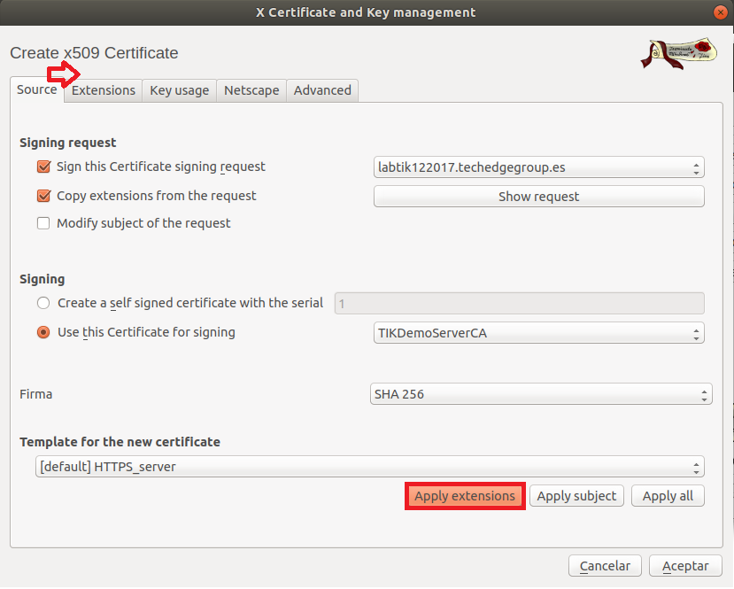

>**AVISO** No olvidar, antes de seguir con la siguiente pestaña el pulsar el botón `Apply Extensions` para asegurarse que se _Apliquen TODAS las extensiones del CSR_.

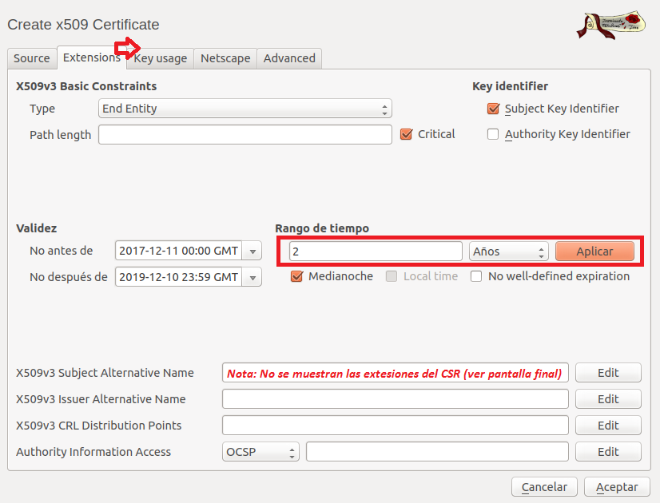

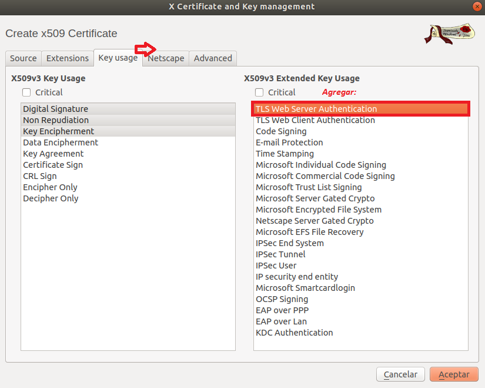

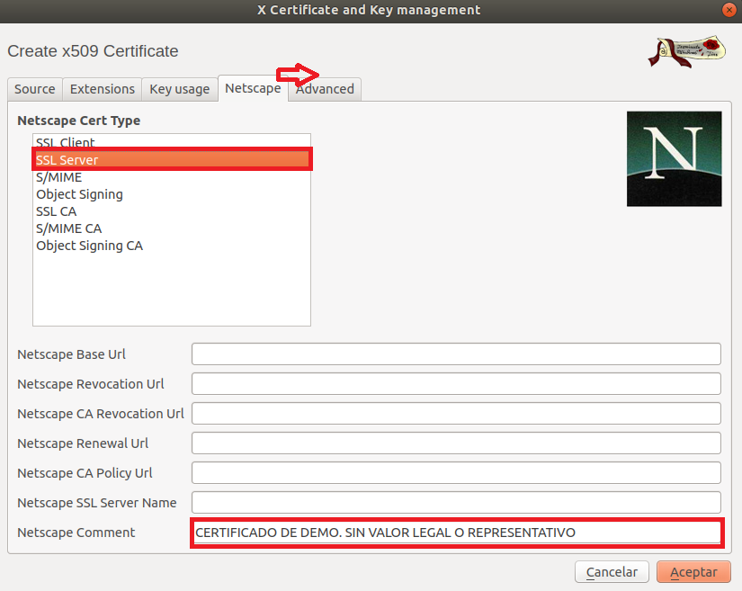

Revisar y pulsar `Aceptar`:

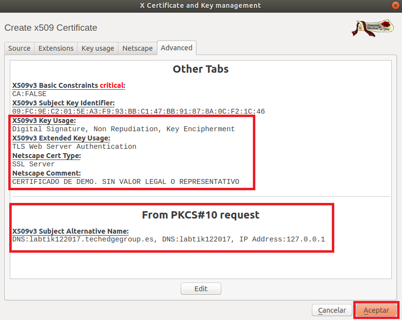

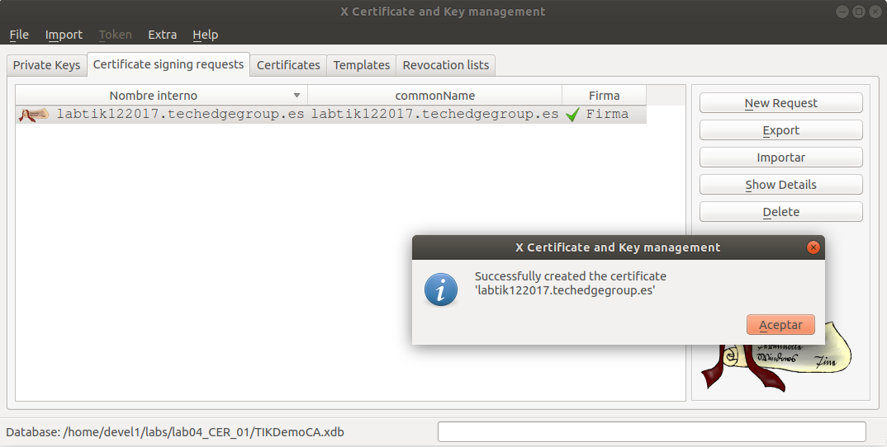

### Paso 3. Revisar detalles del `Certificado X.509` y exportarlo para hacerlo disponible al `SOLICITANTE`:

Visualización:

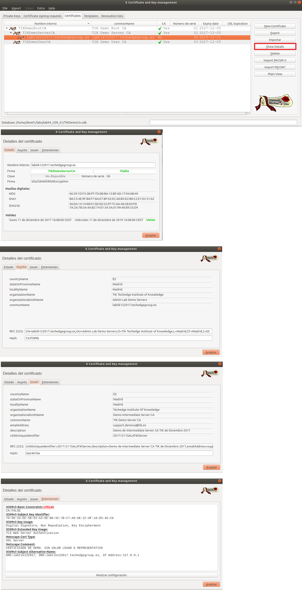

Exportación:

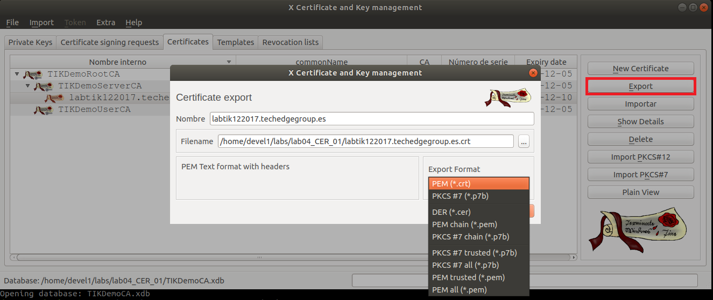

Formato `PEM` y extensión `.crt`:

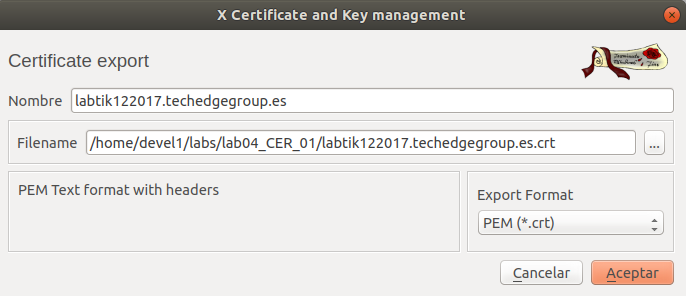

```
gcr-viewer labtik122017.techedgegroup.es.crt
```

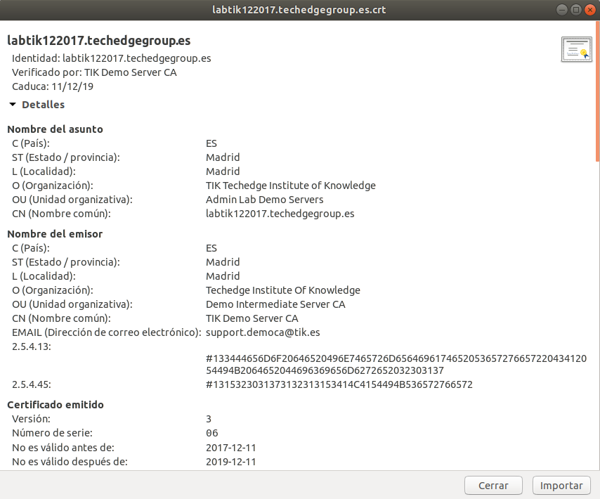

Formato `DER` y extensión `.cer`:

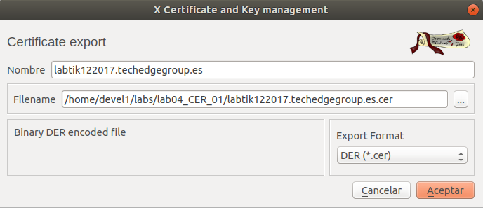

Formato `PEM` con la `Cadena de Certificados en formato PEM`:

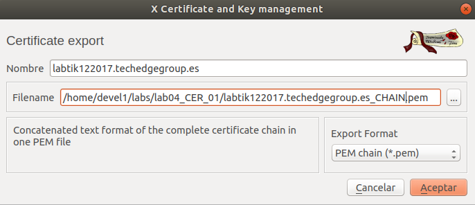

```
$ cat labtik122017.techedgegroup.es_CHAIN.pem
-----BEGIN CERTIFICATE-----
MIIFLzCCBBegAwIBAgIBBjANBgkqhkiG9w0BAQsFADCCASExCzAJBgNVBAYTAkVT
MQ8wDQYDVQQIEwZNYWRyaWQxDzANBgNVBAcTBk1hZHJpZDEoMCYGA1UEChMfVGVj
aGVkZ2UgSW5zdGl0dXRlIE9mIEtub3dsZWRnZTEkMCIGA1UECxMbRGVtbyBJbnRl
cm1lZGlhdGUgU2VydmVyIENBMRswGQYDVQQDExJUSUsgRGVtbyBTZXJ2ZXIgQ0Ex
JDAiBgkqhkiG9w0BCQEWFXN1cHBvcnQuZGVtb2NhQHRpay5lczE9MDsGA1UEDRM0
RGVtbyBkZSBJbnRlcm1lZGlhdGUgU2VydmVyIENBIFRJSyBkZSBEaWNpZW1icmUg
MjAxNzEeMBwGA1UELRMVMjAxNzEyMTFTQUxBVElLU2VydmVyMB4XDTE3MTIxMTE1
MDgwMFoXDTE5MTIxMTE1MDgwMFowgaYxCzAJBgNVBAYTAkVTMQ8wDQYDVQQIDAZN
YWRyaWQxDzANBgNVBAcMBk1hZHJpZDEsMCoGA1UECgwjVElLIFRlY2hlZGdlIElu
c3RpdHV0ZSBvZiBLbm93bGVkZ2UxHzAdBgNVBAsMFkFkbWluIExhYiBEZW1vIFNl
cnZlcnMxJjAkBgNVBAMMHWxhYnRpazEyMjAxNy50ZWNoZWRnZWdyb3VwLmVzMIIB
IjANBgkqhkiG9w0BAQEFAAOCAQ8AMIIBCgKCAQEAuZ2cuF1uFrjpKNyHhw/9iAM6
XA0cn7qjWBb2PDFJL1D1mIyAIzVOib56tn/IzUX/unGslcvcqS2KFkQbghLxdfTS
HF9SoKybh/tZDckc4Im6XqNhVArQYLMwKaIRObk+HeOfD3+MeB9R+pIKY2YOK89/
2RjoRb5BKzYnlxxhqPJdugrzW8dFrUXEzV6Kvd8eA7EOpQm/QTU6VMjVwfvARd2l
1M9UDBJA27oqUhJmVQzAgJPlwtuVLMMO2UudxfAiSLWW4FnZk7RGzaUncBo3q/8f
M35yktvk4TMqMzeH3PNHkrUYvebqCaI6CJ+9AiaJIMcZGgmlf2/gbIRPmWJlWwID
AQABo4HpMIHmMAwGA1UdEwEB/wQCMAAwHQYDVR0OBBYEFHCZHe5bk6MOuFx7x6kO
Hw8Y1UXGMAsGA1UdDwQEAwIF4DATBgNVHSUEDDAKBggrBgEFBQcDATARBglghkgB
hvhCAQEEBAMCBkAwRAYJYIZIAYb4QgENBDcWNUNFUlRJRklDQURPIERFIERFTU8u
IFNJTiBWQUxPUiBMRUdBUiBPIFJFUFJFU0VOVEFUSVZPMDwGA1UdEQQ1MDOCDGxh
YnRpazEyMjAxN4IdbGFidGlrMTIyMDE3LnRlY2hlZGdlZ3JvdXAuZXOHBH8AAAEw
DQYJKoZIhvcNAQELBQADggEBACFwKTuSaFZFxhwUk4E0NUXfomTx43wiTWqnstFx
R3cptWbBcMmjh2sSinraJ3sJd5FJ8V+SAHRhPKIh9XGLxOpORfl3dYK5A3lMWnaM
E62YrgKtWBTSZAv8u2kMG0uiMiQhvB3Smde8BnSUJ2NvjTTleSUJs43oBue+u0pl
cPbODNv0Np0Rox2YCp0PfOd11Su8qa6MQCPYEWJUNDIYzj3WFQBMQugCmvD8SwqD
xb8Wq9VInN+p57LORUzItkihTCURy4OMKeXiALRdSGvGYHtxJ0Y3tuihmwaSEV1f
pQ8lzX2LucRyVdV34S0nwsUVFo+g3HnB73LUpWjlVfVSfN4=
-----END CERTIFICATE-----
-----BEGIN CERTIFICATE-----
MIIFPjCCBCagAwIBAgIBAjANBgkqhkiG9w0BAQsFADCB/zELMAkGA1UEBhMCRVMx
DzANBgNVBAgTBk1hZHJpZDEPMA0GA1UEBxMGTWFkcmlkMSgwJgYDVQQKEx9UZWNo
ZWRnZSBJbnN0aXR1dGUgT2YgS25vd2xlZGdlMRUwEwYDVQQLEwxEZW1vIFJvb3Qg
Q0ExGTAXBgNVBAMTEFRJSyBEZW1vIFJvb3QgQ0ExJDAiBgkqhkiG9w0BCQEWFXN1
cHBvcnQuZGVtb2NhQHRpay5lczEuMCwGA1UEDRMlRGVtbyBkZSBSb290IENBIFRJ
SyBkZSBEaWNpZW1icmUgMjAxNzEcMBoGA1UELRMTMjAxNzEyMTFTQUxBVElLUm9v
dDAeFw0xNzEyMDYwMDAwMDBaFw0yNzEyMDUyMzU5NTlaMIIBITELMAkGA1UEBhMC
RVMxDzANBgNVBAgTBk1hZHJpZDEPMA0GA1UEBxMGTWFkcmlkMSgwJgYDVQQKEx9U
ZWNoZWRnZSBJbnN0aXR1dGUgT2YgS25vd2xlZGdlMSQwIgYDVQQLExtEZW1vIElu
dGVybWVkaWF0ZSBTZXJ2ZXIgQ0ExGzAZBgNVBAMTElRJSyBEZW1vIFNlcnZlciBD
QTEkMCIGCSqGSIb3DQEJARYVc3VwcG9ydC5kZW1vY2FAdGlrLmVzMT0wOwYDVQQN
EzREZW1vIGRlIEludGVybWVkaWF0ZSBTZXJ2ZXIgQ0EgVElLIGRlIERpY2llbWJy
ZSAyMDE3MR4wHAYDVQQtExUyMDE3MTIxMVNBTEFUSUtTZXJ2ZXIwggEiMA0GCSqG
SIb3DQEBAQUAA4IBDwAwggEKAoIBAQDyFZNRhb7eKFx1HMzi0MoHRsgXmCCfKkDn
HfJ6XEonjvaA/wQZovbPd2UwPQ6wFW5sWqALdbekSBrYvA3El83gS/yF0P1kuQqS
XdOG1iyMKJA2JGB3Uf658WTrcUtKQBftoExIBpNGoC/9nP23T2paLqJjkAfd/wez
BcGBxDhcBdRZmVHNh9siRJwS5IkkBj8S4huOUPL5CdU8qMapCt7vlFrChSRnFlX6
71Yq+GUAXaDM90WGLTDAQeqMvYVFhmaiyKwEzdhqVG+MvOTjoRx/ufBqFVMDRIbH
18FUmaPtQVC3jQPmW5VZlCZ69KZJ8dyyzj9zoEh808LOkphV8l7hAgMBAAGjgZ8w
gZwwDwYDVR0TAQH/BAUwAwEB/zAdBgNVHQ4EFgQULVVmcQKYw/LIoi9dCtPWsZs6
aEIwCwYDVR0PBAQDAgEGMBEGCWCGSAGG+EIBAQQEAwIABzBKBglghkgBhvhCAQ0E
PRY7RGVtbyBSb290IENBIFBhcmEgVFJBSU5JTkcgc2luIFZBTE9SIExFR0FMIE8g
UkVQUkVTRU5UQVRJVk8wDQYJKoZIhvcNAQELBQADggEBAHUx+x8v1YhEHNssl1aZ
+EvyQB04tmuouhlLjA5d4zLXcCzCKvXyNr9l/DKhWhyr+NV6HBzwDdhC3MnP6bg4
tdB/zc50FlSjlnpDZ7GA9u0z33lH2lZrWCYWtScwcXTe9xU9/sPalYVHmrTs6VH6
W749dpq5pJyeMltS728YA+NDXLvij5sbMRWiVIhNVSToanmuRZVv38BtNK6vtgG4
hk0wo9lJ6dHDOJwuUiMaqe8w7mKXXozOmIWY0nWmrjY5MSMdYUSOP/5y3pBflxyL
YlWbeFRDJJRue8qM8KDr25G/287OJqty/TRnANKr2vDK2Bz323aKGOo2iL40knbd
4IQ=
-----END CERTIFICATE-----
-----BEGIN CERTIFICATE-----
MIIFGzCCBAOgAwIBAgIBATANBgkqhkiG9w0BAQsFADCB/zELMAkGA1UEBhMCRVMx
DzANBgNVBAgTBk1hZHJpZDEPMA0GA1UEBxMGTWFkcmlkMSgwJgYDVQQKEx9UZWNo
ZWRnZSBJbnN0aXR1dGUgT2YgS25vd2xlZGdlMRUwEwYDVQQLEwxEZW1vIFJvb3Qg
Q0ExGTAXBgNVBAMTEFRJSyBEZW1vIFJvb3QgQ0ExJDAiBgkqhkiG9w0BCQEWFXN1
cHBvcnQuZGVtb2NhQHRpay5lczEuMCwGA1UEDRMlRGVtbyBkZSBSb290IENBIFRJ
SyBkZSBEaWNpZW1icmUgMjAxNzEcMBoGA1UELRMTMjAxNzEyMTFTQUxBVElLUm9v
dDAeFw0xNzEyMDYwMDAwMDBaFw0yNzEyMDUyMzU5NTlaMIH/MQswCQYDVQQGEwJF
UzEPMA0GA1UECBMGTWFkcmlkMQ8wDQYDVQQHEwZNYWRyaWQxKDAmBgNVBAoTH1Rl
Y2hlZGdlIEluc3RpdHV0ZSBPZiBLbm93bGVkZ2UxFTATBgNVBAsTDERlbW8gUm9v
dCBDQTEZMBcGA1UEAxMQVElLIERlbW8gUm9vdCBDQTEkMCIGCSqGSIb3DQEJARYV
c3VwcG9ydC5kZW1vY2FAdGlrLmVzMS4wLAYDVQQNEyVEZW1vIGRlIFJvb3QgQ0Eg
VElLIGRlIERpY2llbWJyZSAyMDE3MRwwGgYDVQQtExMyMDE3MTIxMVNBTEFUSUtS
b290MIIBIjANBgkqhkiG9w0BAQEFAAOCAQ8AMIIBCgKCAQEAwlydq+Uabqodfod3
I+Nsr5l13uBhBqPM+4/j4RbCzk08t7fczOspYR9Du5Q7WwaGE9M6mHrR303aeznL
GQbDFXZIsrIO/EzJorvUu2uKRGo0LLu6+Hfezybkn34GtvPES5ItPFeeI1/aCQfZ
tDNltQUMAOIZL0YMnTC9yF/4P072Hd5WlafhEa/JnIqkNueuI/c4T+8FAqBMEWCL
4v1vN9xcuDBd/8AQiW7QcTkilbYVil+R9GcKpmA00Mj25rMXnEM7w8Htdicpcahe
PsjFCTb+NsEAjQ/HYqb9LqH5b9n7aerpWykD6xb7qRK69oNr8LuSiAR5fWJfT6KT
Gn9WHwIDAQABo4GfMIGcMA8GA1UdEwEB/wQFMAMBAf8wHQYDVR0OBBYEFLH51RwF
J82kjyKlwjK2UREkIfnPMAsGA1UdDwQEAwIBBjARBglghkgBhvhCAQEEBAMCAAcw
SgYJYIZIAYb4QgENBD0WO0RlbW8gUm9vdCBDQSBQYXJhIFRSQUlOSU5HIHNpbiBW
QUxPUiBMRUdBTCBPIFJFUFJFU0VOVEFUSVZPMA0GCSqGSIb3DQEBCwUAA4IBAQBw
TYsgty6WTSlrv79klmm4xwqYpTMCp9YvrD2/mLETAXEYOWOHDdVqXEdhmtTUlFkm
e6VkjrGz1kXHXFhTb7ZIptiBD/VBCLisJUju8RFIz46sIVXLLlwkHmqqSNSR/WN8
rw3yOc4tXY/Rz3+IxaCCtR8sPSme9KLsKiPm9orBEF7/OXZgSUSQpCmURQq1CBRM
vy611o6AHBpj8/5o2fJMcwgPAlU1Kg3ouihVoKePzzTPmQV78pTpeh6SsHQO3y5q
/zNhZAAmcndVOAhIyEEOs3ZWyBTfKmylLBhaqpqjjk5PgZl7CE8HRwDfFGZ3hEI9
PNHrv96O6wHdE055D3Xa
-----END CERTIFICATE-----

```
```
gcr-viewer labtik122017.techedgegroup.es_CHAIN.pem
```
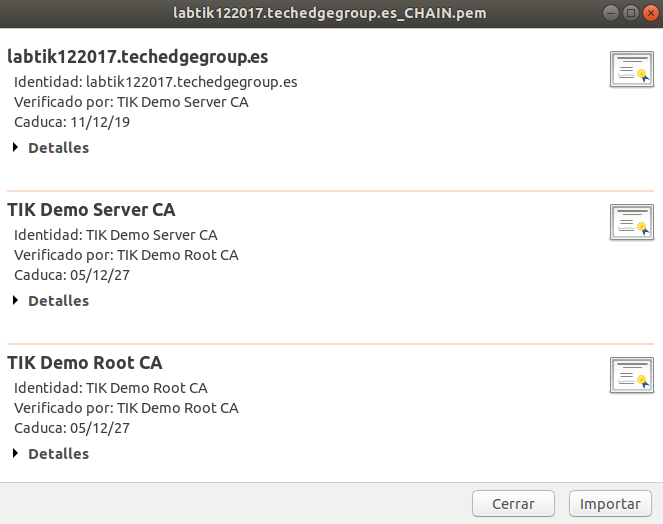


Formato `DER` con la `Cadena de Certificados en formato PKCS#7` y extensión `.p7b`:

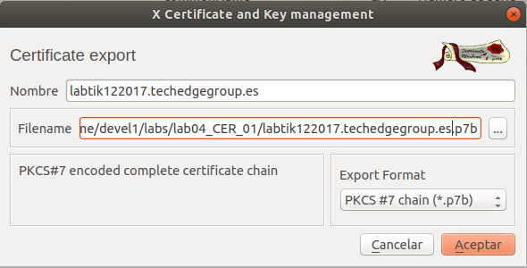

```
gcr-viewer labtik122017.techedgegroup.es.p7b
```

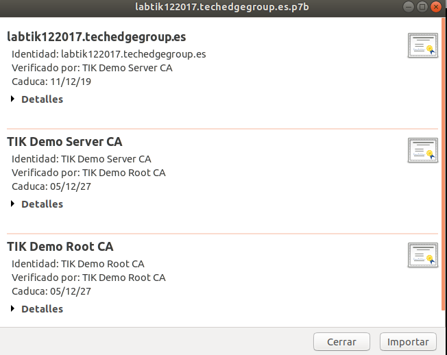

### Paso 4. Hacer disponible al `SOLICITANTE` el certificado generado junto con los certíficados X.509 de `Cadena de Certificación` con la que se firmó:


Dependiendo de la 


Recordar:

```
  openssl pkcs7 -in labtik122017.techedgegroup.es.p7b -out TIK_CA_chain.pem -inform DER -outform PEM -print_certs

  subl TIK_CA_chain.pem  (Dejar solo, y en orden,los certificados de la CA)

  openssl pkcs12 -export -out labtik122017.techedgegroup.es.p12 -inkey labtik122017_privkey.pem -name labtik122017.techedgegroup.es -in labtik122017.techedgegroup.es.crt -CAfile TIK_CA_chain.pem -certfile TIK_CA_chain.pem -passin pass:changeit -passout pass:changeit

  openssl pkcs12 -info -in labtik122017.techedgegroup.es.p12 

  keytool -importkeystore -srckeystore labtik122017.techedgegroup.es.p12 -srcstoretype pkcs12 -srcalias labtik122017.techedgegroup.es -srcstorepass changeit -destkeystore labtik122017.techedgegroup.es.jks -deststoretype jks -deststorepass changeit -destalias labtik122017.techedgegroup.es

```